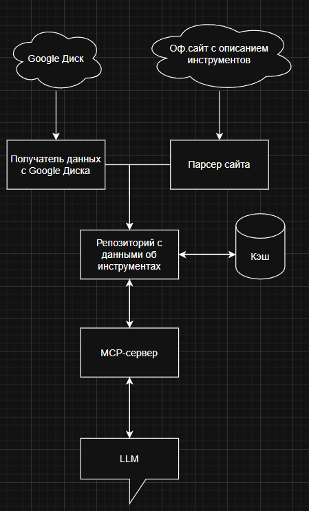

# MCP-Сервер для Reality Calendar

https://github.com/user-attachments/assets/7f87c87e-10ac-43d2-ace2-c180b1a92d1a

## Уровень 1
У нас есть Excel-файл, который лежит на Google-диске, в котором лежит список инструментов и ссылка на их описание. Для того, чтобы LLM могла взаимодействовать с этими данными, я решил использовать MCP-сервер. Но при каждом запросе от пользователя получать файлы с Диска, потом их парсить и преобразовывать долго + кол-во запросов к Диску может быть ограничено, поэтому для улучшения эффективности на сервере будет слой кэша, из которого он и будет брать информацию. Кэш будет обновляться при каждом перезапуске сервера + 1 раз в день на фоне.
Слой кэша можно реализовать при помощи Redis, но тогда придется поднимать несколько контейнеров, а это дополнительная сложность при деплое. Поэтому на сервере будет лежать база SQLite, которая будет выступать в качестве кэша, а также хранилища воркеров для APScheduler, который отвечает за фоновую синхронизацию данных между файлом на Диске и кэшом.
Также указано, что нужно использовать OpenWebUI, однако он не поддерживает работу с MCP-серверами напрямую, предлагая использовать OpenAI-прокси. Для этого понадобится пакет mcpo, который сможет превратить наш MCP-сервер в прокси OpenAI, которые может использовать OpenWebUI
Для реализации всего этого я выбрал следующий стек:
### Инструменты:
* uv - пакетный менеджер для проекта

### Пакеты:
* mcp - официальный фреймворк для написания MCP-серверов на Python. Имеет поддержку дебагинга, что упростит тестирование.
* googleclient (и еще куча пакетов от Google) - для работы с Google Drive API
* SQLAlchemy - ORM для взаимодействия с базой данных
* APScheduler - фреймворк для создания фоновых задач с интервалом по времени
* Requests & BeautifulSoup - золотой стандарт для парсинга сайтов. Понадобятся для получения сведений об инструментах с их официальных страниц
* Pydantic - для валидации данных внутри приложения
* Openpyxl - для работы с Excel-файлами
* mcpo - Для создания прокси OpenAI для OpenWebUI

### Схема приложения


## Уровень 2
Во время тестирования агента в OpenWebUI я столкнулся с одной проблемой - по какой-то причине, нейронки плохо распознают подключенные через прокси MCP. Возможно, проблема в моей конфигурации, а возможно в плохом прокси. В любом случае, подключение к OpenWebUI возможно, и инструменты отображаются в доступных, если попросить нейросети вызвать инструменты, то они действительно обращаются к инструментам и ресурсам.

## Уровень 3
Собственно, ради этого мы тут и собрались. Все, что необходимо - в репозитории, для запуска необходим .env файл со следующими параметрами:

```
DATABASE_URI="sqlite:///cache.db" - URL базы данных, при валидации будет ошибка, если база не SQLite
CREDENTIALS_PATH="./token.json" - Путь до конфига, который выдается при авторизации в приложении
FILENAME="data.xlsx" - название файла на диске, в котором хранятся необходимые данные
HOST="127.0.0.1" - Хост, на котором запускается сервер
PORT=8001 - Порт, на котором запускается сервер
```

Для тестирования проекта можно воспользоваться командой ```uv run mcp dev app.py```, которая запустит тестовый сервер, на котором в визуальном интерфейсе можно проверить на корректность функции.

### Подключение к Google Диску
Нужно создать приложение в Google Cloud Platform, там включить Google Drive API, далее создать в разделе OAuth клиент Desktop для авторизации, и полученный файл credentials.json положить в ту же папку, что и main.py, а далее приложение само вызовет окно авторизации в Google-аккаунте, и создаст token.json, который в дальнейшем будет использоваться для авторизации 
